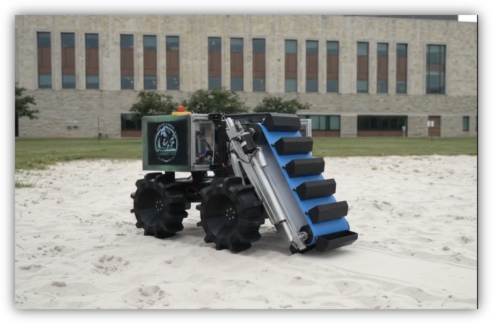
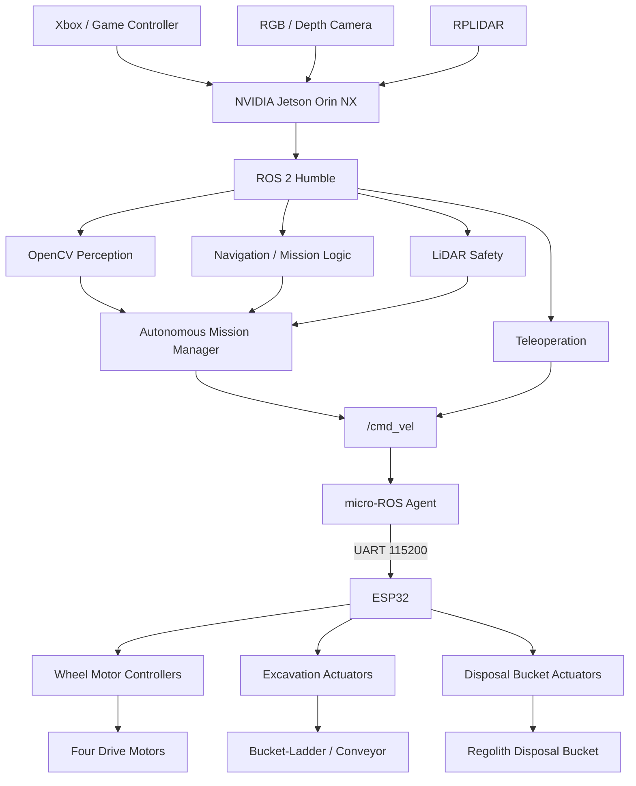
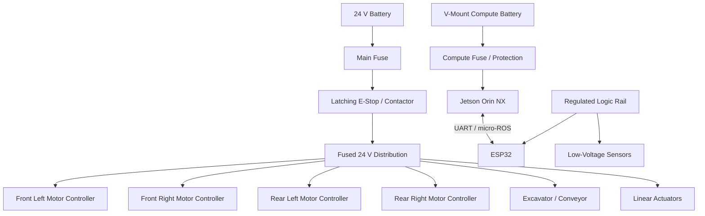

> **New simulation review branch:** [Full rover CAD, Gazebo/RViz launch and KiCad Rev C](docs/SIMULATION_REVIEW.md). Reference-derived geometry; runtime and electrical review remain pending.

<p align="center"></p>

# NASA Lunabotics · UHCL Lunar Hawks

### Proof-of-concept lunar excavation rover
Embedded systems · ROS 2 · micro-ROS · OpenCV · LiDAR · Gazebo · Hardware integration

A University of Houston–Clear Lake student and research rover project for lunar-regolith excavation, collection, transportation, and disposal.

This repository brings together the Lunar Hawks rover's ESP32 firmware, NVIDIA Jetson ROS 2 software, micro-ROS communication, mechanical models, electrical documentation, Gazebo simulation assets, and ongoing autonomous-navigation development.

**Status: prototype / research.** Physical rover subsystems have been demonstrated, while the newly added autonomous mission software and simulation environment remain development implementations requiring integration and validation on the physical rover.

This is a team-member-maintained academic/research repository and is **not a NASA-owned or NASA-endorsed software release**.

[ROS 2](ros2_ws/README.md) ·
[micro-ROS](firmware/micro_ros/README.md) ·
[MicroPython](firmware/micropython/README.md) ·
[Autonomy](ros2_ws/src/lunabotics_autonomy/) ·
[Gazebo Simulation](simulation/) ·
[CAD](cad/) ·
[Control PCB](hardware/rover_control_pcb/README.md) ·
[Research](docs/publication/README.md) ·
[Testing](docs/testing/README.md)

<p align="center"></p>

---

## Project objectives

The Lunar Hawks rover is being developed as a proof-of-concept robotic platform for lunar excavation research.

The overall mission architecture is intended to support:

1. Entering a simulated or competition excavation environment.
2. Navigating using LiDAR and camera sensing.
3. Identifying traversable regolith terrain.
4. Operating the front bucket-ladder / conveyor excavation mechanism.
5. Transporting collected material.
6. Detecting the disposal area using computer vision.
7. Identifying the four goal-post features surrounding the disposal zone.
8. Aligning the rover with the goal.
9. Activating the disposal bucket.
10. Returning to navigation or excavation behavior.

The current autonomous software is a development baseline rather than a fully validated competition autonomy stack.

---

## Demonstration and evidence

[Watch the archived Gazebo simulation clip](media/Gazebo_Sim.mp4) ·
[Original software documentation](docs/legacy/UHCL_NASA_Lunabotics_Rover_Software_Documentation.pdf)

The physical rover project has demonstrated subsystem functionality including:

- Forward and reverse mobility
- Differential-drive turning
- Wireless teleoperation
- Conveyor / bucket-ladder operation
- Material transportation
- Disposal-bucket actuation
- Jetson-to-ESP32 communication
- micro-ROS integration
- LiDAR integration
- Camera integration

These historical demonstrations do **not** automatically validate the newly added autonomy, Gazebo, CAD, or electrical-development files.

Physical test videos, measured results, software revisions, and dated validation records should continue to be added to the [testing evidence register](docs/testing/README.md).

| Area | Included here | Verification status |
| --- | --- | --- |
| ESP32 micro-ROS | Original C firmware and integration metadata | Preserved project source; hardware revalidation recommended |
| Jetson ROS 2 | Teleoperation and controller software | Existing architecture; environment validation ongoing |
| OpenCV vision | Goal-post and regolith detection nodes | Development baseline; physical threshold tuning required |
| LiDAR autonomy | Front-obstacle safety node | Implemented baseline; rover testing required |
| Mission control | Autonomous excavation/transport/disposal state machine | Implemented baseline; not yet a demonstrated full autonomous mission |
| Gazebo simulation | Lunabotics arena world and rover model | Source added; integrated launch and runtime validation still required |
| Mechanical CAD | Original rover STLs plus autonomy-development CAD | New models are reference/development geometry |
| Rover wheel | 304.8 mm × 100 mm conceptual wheel with 12 grousers | Parametric recreation; hub dimensions must be verified before fabrication |
| Rover control PCB | Requirements, interfaces, BOM, and review material | Concept / design-review stage |
| Electrical Rev B | Architecture recommendations and schematic review | Engineering-development documentation |
| Research | Manuscript/project documentation | Research publication workflow ongoing |

---

# System architecture



The architecture separates high-level robotics computation from low-level actuator control.

### NVIDIA Jetson

The Jetson is responsible for higher-level robotics functions such as:

- ROS 2
- Computer vision
- LiDAR processing
- Mapping and localization
- Navigation
- Mission coordination
- Future autonomous excavation behavior

### ESP32

The ESP32 provides hardware-facing embedded control including:

- Motor command generation
- PWM
- Direction control
- Actuator control
- micro-ROS communication
- Hardware safety behavior

The deployed ESP32-WROOM implementation and any future ESP32-S3 control PCB should **not be assumed to be pin-compatible or firmware-compatible without verification**.

---

# Autonomous mission development

The repository now contains an experimental ROS 2 autonomy package:

```text
ros2_ws/src/lunabotics_autonomy/
```

Major nodes include:

### Goal-post detector

```text
goal_post_detector.py
```

Uses OpenCV image processing to locate vertical goal-post candidates from the camera stream.

Publishes goal information that can be used to center the rover between the visible posts.

Development topics include:

```text
/vision/goal_posts/target
/vision/goal_posts/count
/vision/goal_posts/debug
```

The current detector uses configurable image-processing thresholds intended primarily as a simulation and development baseline.

---

### Regolith detector

```text
regolith_detector.py
```

Provides a preliminary OpenCV terrain-classification method for identifying regolith-like regions.

The current implementation is intentionally simple and should eventually be replaced or supplemented with perception trained and tested using representative lunar-regolith imagery.

---

### LiDAR safety

```text
lidar_safety.py
```

Processes `/scan` data and monitors the forward sector of the rover.

It can issue an obstacle-stop condition if an object is detected inside the configured safety distance.

Example topics:

```text
/safety/obstacle_stop
/safety/front_clearance
```

---

### Mission manager

```text
mission_manager.py
```

Implements a development state machine:

```text
ENTER
  ↓
SEARCH_REGOLITH
  ↓
EXCAVATE
  ↓
SEARCH_GOAL
  ↓
ALIGN_GOAL
  ↓
DUMP
  ↓
DONE
```

The mission manager can command:

```text
/cmd_vel
/excavator/enable
/bucket/dump
```

These outputs are intended to eventually interface with the existing ESP32 / micro-ROS hardware layer.

---

# Gazebo simulation

A Lunabotics-inspired Gazebo development environment is included under:

```text
simulation/worlds/
```

Current world:

```text
lunabotics_arena.world
```

The environment contains:

- Excavation terrain
- Arena boundaries
- Disposal region
- Four visual goal posts
- A simplified mission layout

The environment is a **development approximation**, not a claim of exact NASA competition-field dimensions.

A simplified rover model is also included:

```text
ros2_ws/src/lunabotics_description/urdf/lunabotics_rover.urdf.xacro
```

It represents:

- Four-wheel differential drive
- Rover chassis
- Front excavation conveyor
- Rear disposal bucket
- LiDAR
- RGB camera

An integrated Gazebo spawn/bringup launch file is still planned.

---

# Computer vision

The autonomy software uses OpenCV as a development perception layer.

Current objectives include:

```text
Camera
   ↓
OpenCV
   ↓
Goal-post detection
   ↓
Four-post confirmation
   ↓
Goal-center calculation
   ↓
Rover alignment
   ↓
Dump sequence
```

Future work may combine camera information with LiDAR geometry for more robust goal detection and navigation.

---

# LiDAR navigation

LiDAR provides the geometric sensing layer for autonomous rover development.

Planned progression:

```text
LiDAR
  ↓
Obstacle detection
  ↓
Localization
  ↓
Mapping
  ↓
Nav2 costmaps
  ↓
Waypoint navigation
  ↓
Mission navigation
```

Future integration is expected to include ROS 2 Nav2 and/or SLAM Toolbox.

---

# Mechanical development

The repository includes both preserved project CAD and new development geometry.

```text
cad/
```

The original supplied meshes remain directly in `cad/`. Generated geometry is separated by purpose:

```text
cad/
├── original supplied STL files
├── full_rover/
│   ├── chassis, bucket and excavator parts
│   ├── ESP32 and Jetson enclosures
│   └── 248 mm and 300 mm wheel variants
└── autonomy_rover/
    ├── goal_post.scad / .stl
    ├── grouser_wheel_12_short.scad / .stl
    └── rover_chassis_simplified.scad / .stl
```

The full-rover wheel set and printable cover variants are documented in [`cad/full_rover/WHEEL.md`](cad/full_rover/WHEEL.md).

## Grouser wheel

The development wheel is based on documented rover dimensions:

- Diameter: **304.8 mm**
- Width: **100 mm**
- Grousers: **12**
- Equal angular spacing: **30°**

The grouser projection in this development model was shortened relative to the initial generated geometry.

The wheel STL is **not fabrication-authoritative**. Hub diameter, shaft bore, bolt-circle dimensions, materials, tolerances, and drivetrain interfaces must be verified against the physical rover.

---

# Electrical architecture

The rover uses separated high-current motor and computing power domains.



Rev-B design recommendations are located in:

```text
docs/electrical/rev_b/
```

They include:

- Main battery protection
- Branch fusing
- Emergency-stop architecture
- Transient suppression
- Power-domain separation
- Logic-rail decoupling
- UART signal protection
- Test points
- Current-monitoring recommendations
- Motor-controller schematic review

One important design-review item is ensuring that schematic symbols and labels accurately represent the physical motor controllers being used.

---

# Start with software-only checks

Clone the repository:

```bash
git clone https://github.com/Matthew-Garcia/NASA-Lunabotics-UHCL-Lunar-Hawks.git

cd NASA-Lunabotics-UHCL-Lunar-Hawks
```

Run MicroPython protocol tests:

```bash
python3 firmware/micropython/test.py
```

Run repository tests:

```bash
python3 -m unittest discover -s tests -v
```

For ROS 2 setup, see:

[ROS 2 workspace instructions](ros2_ws/README.md)

For micro-ROS integration:

[micro-ROS notes](firmware/micro_ros/README.md)

Before powering physical motors or actuators:

[Electrical safety checklist](docs/electrical/SAFETY.md)

---

# Repository map

| Path | Purpose |
| --- | --- |
| `firmware/micro_ros/` | ESP32 C / micro-ROS firmware |
| `firmware/micropython/` | MicroPython communication prototype |
| `ros2_ws/src/lunabotics_teleop/` | ROS 2 controller and teleoperation package |
| `ros2_ws/src/lunabotics_autonomy/` | OpenCV, LiDAR, and autonomous mission development |
| `ros2_ws/src/lunabotics_description/` | Rover URDF/Xacro description |
| `simulation/worlds/` | Gazebo Lunabotics arena |
| `hardware/rover_control_pcb/` | Proposed rover-control/interface PCB |
| `cad/` | Mechanical models and original STL files |
| `cad/full_rover/` | Full rover reconstruction, excavator, bucket, enclosures and wheel variants |
| `cad/autonomy_rover/` | Earlier simplified autonomy-development CAD and goal-post geometry |
| `docs/architecture/` | Interfaces, command semantics, and system architecture |
| `docs/electrical/` | Electrical safety and architecture documentation |
| `docs/electrical/rev_b/` | Rev-B electrical recommendations and schematic review |
| `docs/testing/` | Evidence register and validation planning |
| `docs/publication/` | Research publication status |
| `docs/legacy/` | Original software documentation |
| `media/` | Rover images, team media, and Gazebo video |
| `tests/` | Host-side software tests |

---

# Development roadmap

- [x] Integrate Jetson and ESP32 architecture.
- [x] Establish ROS 2 teleoperation.
- [x] Establish micro-ROS communication.
- [x] Integrate LiDAR hardware.
- [x] Integrate camera hardware.
- [x] Demonstrate rover mobility.
- [x] Demonstrate excavation conveyor operation.
- [x] Demonstrate disposal-bucket actuation.
- [x] Add OpenCV goal-post detection baseline.
- [x] Add regolith-vision development node.
- [x] Add LiDAR obstacle-safety node.
- [x] Add autonomous mission state-machine baseline.
- [x] Add Gazebo Lunabotics arena source.
- [x] Add simplified rover URDF/Xacro.
- [x] Add 12-grouser wheel development CAD.
- [x] Add Rev-B electrical architecture review.
- [ ] Complete ROS package for rover description and Gazebo spawning.
- [ ] Add combined simulation launch file.
- [ ] Integrate ROS 2 Nav2.
- [ ] Integrate SLAM / localization.
- [ ] Fuse camera and LiDAR perception.
- [ ] Validate four-post detection using representative physical targets.
- [ ] Validate autonomous navigation on the physical rover.
- [ ] Integrate autonomous excavation control with ESP32 firmware.
- [ ] Implement mission recovery and watchdog behavior.
- [ ] Record quantitative excavation and navigation results.
- [ ] Complete and independently review production PCB schematic/layout.
- [ ] Demonstrate a complete autonomous excavation → transport → disposal mission.

---

# Research

**Matthew Garcia**  
Repository maintainer · Robotics systems integration · Embedded systems · ROS 2 / autonomy contributor

**Dr. Luong Nguyen, Ph.D.**  
Research adviser · Co-author

Credit also belongs to the **University of Houston–Clear Lake Lunar Hawks team** and the students who designed, built, tested, and improved the rover platform.

Research project:

*Design and Implementation of a Proof-of-Concept Excavating Rover Platform for Lunar Regolith Collection and Transportation*

The project has been accepted for presentation at **ISMCR 2026 — International Symposium on Measurement and Control in Robotics**.

Research documentation and publication status are maintained under:

[Read the author manuscript (Word)](docs/publication/manuscript/Nguyen_Garcia_ISMCR2026_Final_Revision.docx) · [Publication status](docs/publication/README.md)

---

## Links

[Matthew Garcia Portfolio](https://matthew-garcia-portfolio.vercel.app/) ·
[LinkedIn](https://www.linkedin.com/in/matthew-garcia-165634195/) ·
[Original UHCL Lunar Hawks Repository](https://github.com/Matthew-Garcia/uhcl-lunar-hawks-lunabotics)

---

# Safety

This repository contains software and design material capable of controlling motors and electromechanical actuators.

Do not connect development software directly to powered hardware without verifying:

- Emergency stop functionality
- Motor-controller pin assignments
- PWM ranges
- Direction logic
- Current limits
- Fuse ratings
- Mechanical clearance
- Command timeout behavior
- Communication-loss behavior

See:

[Electrical Safety](docs/electrical/SAFETY.md)

---

# License and provenance

The original MIT license is retained.

See [NOTICE](NOTICE.md) for source revision, provenance, and rights information.

Some newer example code and engineering-development artifacts were created with AI-assisted development and should be independently reviewed, tested, and validated before use on physical hardware.
