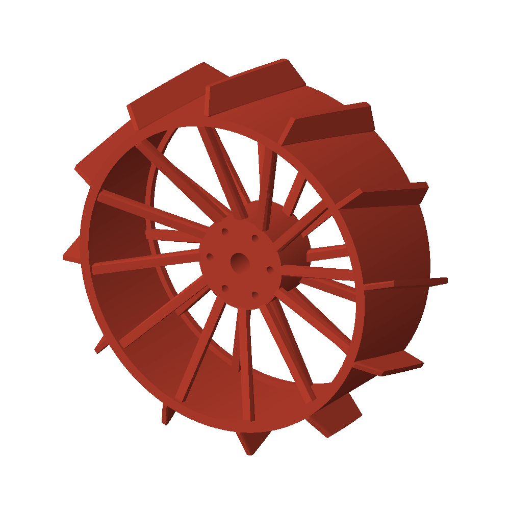

# Swept-fin wheel with removable side covers

This revision retains the 248 mm outside diameter, twelve equally spaced fin stations (30 degrees), and reinforced rim/spokes. It changes the nominal sweep from approximately 16.7 degrees to 25 degrees across the face, reduces tangential fin tips from 8 to 4 mm and roots from 14 to 10 mm, and adds removable covers to both sides.

The angle is defined in the local tangential/axial construction plane; the cylindrical clipping and tapered shoulders change the local edge shape. These are swept fins, not chevrons. They are not guaranteed to eject soil or improve traction, and a single sweep direction can introduce lateral thrust. No comparative BP-1 tests have been performed.

## Print and assemble

| File | Quantity per wheel | Size in mm | Purpose |
| --- | --- | --- | --- |
| `wheel.stl` | 1 | 248 × 248 × 94 | Printable structural wheel body |
| `wheel_cover.stl` | 2 | 204 × 204 × 3 | Identical removable side covers |
| `wheel_assembled.stl` | Do not print as one part | 248 × 248 × 100 | Assembled visual mesh for Gazebo/RViz |
| `wheel_300mm_lab.stl` | 1 | 300 × 300 × 100 | Open-face lab-printer test article requested for an initial field evaluation |

Print the body axle-up at 100% scale, centered on the nominal 256 mm plate, and drop it to the bed. The body leaves 4 mm per side; a 3 mm brim has a 254 mm bounding envelope. Print each cover flat in a separate job/plate as needed. Confirm supports beneath the recessed hub/spokes, prime paths, machine exclusion areas, brim and filament/time estimates in the actual slicer profile. No Bambu Studio slice or physical print has been verified here.

The separate `wheel_300mm_lab.stl` is the full-size laboratory-printer version. It has a 300 mm outside diameter, 100 mm width, twelve swept fins at 30 degree spacing, and an open face. It does not fit the 256 mm Bambu X1C plate as a single part. Confirm the laboratory printer's usable XY area, edge margin, Z clearance and slicer-generated toolpath before starting the print. The 18 mm bore and six-hole 55 mm bolt circle are still provisional and must be measured against the physical hub before a rover-mounted test.

Each cover has six 3.4 mm clearance holes on a 196 mm bolt circle, aligned with 2.5 mm pilot holes about 8 mm deep in the wheel rim. A nominal M3×10 fastener through a 3 mm cover provides about 7 mm engagement. This is a prototype fastening layout, not a qualified plastic thread: confirm pilot size/thread method with the chosen material and a coupon before assembly. Fasteners are not modeled in the assembled STL. Access and mount the wheel hub before installing the covers.

Both covers have a 28 mm center opening. They reduce direct bulk-soil entry through the spoke faces, but they are **not dust seals**: shaft clearance, screws and cover seams can admit fines. A hub-specific collar/gasket is still needed for dust exclusion. Remove covers to inspect and clean; do not assume contamination cannot accumulate.

## Retained structure and interfaces

- Tread band: 8 mm radial thickness; edge rings: 14 mm radial × 12 mm axial.
- Spoke endpoint tangential/axial sections: 16 × 12 mm.
- Hub: 90 mm diameter × 64 mm long.
- Fin projection: 22 mm radial, retained from the earlier half-height request, not optimized for BP-1.
- Provisional hub: 18 mm bore and six 6.5 mm mounting holes on a 55 mm bolt circle. Actual shaft/bolt fit and cover clearance require measurement.

The body is 6 mm narrower to accommodate two 3 mm covers while retaining 100 mm assembled width. Mesh validity and nominal print-envelope results are in `wheel_fit_report.json`. Solid CAD volume is not a slicer material estimate.

## Simulation and comparison

All four wheel visuals use `wheel_assembled.stl`. Collision radius (0.124 m), drive diameter (0.248 m), and previous reduced chassis height are retained. Simplified collision cylinders, estimated mass/inertia, and scripted material pickup do not validate fin/soil interaction. Existing runtime screenshots predate this geometry.

Test the previous and revised wheels at the same load, soil preparation and travel speed. Compare drawbar pull, slip, sinkage, drive current, sideways movement and retained soil after straight driving, turns and reversing. Inspect fin roots, rim and cover fasteners. Do not infer either guaranteed failure or guaranteed improvement from appearance alone. Grouser geometry interacts with slip and sinkage, as discussed in [CMU's grouser-spacing study](https://publications.ri.cmu.edu/storage/publications/pub_files/2012/10/SkoniecznyIROS2012.pdf).

## Regenerate

```bash
openscad -o cad/full_rover/wheel.stl -D 'part="wheel"' cad/full_rover/rover.scad
openscad -o cad/full_rover/wheel_cover.stl -D 'part="wheel_cover"' cad/full_rover/rover.scad
openscad -o cad/full_rover/wheel_assembled.stl -D 'part="wheel_assembled"' cad/full_rover/rover.scad
openscad -o cad/full_rover/wheel_300mm_lab.stl cad/full_rover/wheel_300mm_lab.scad
python3 tools/build_description.py
python3 tools/preview_wheel.py
```


