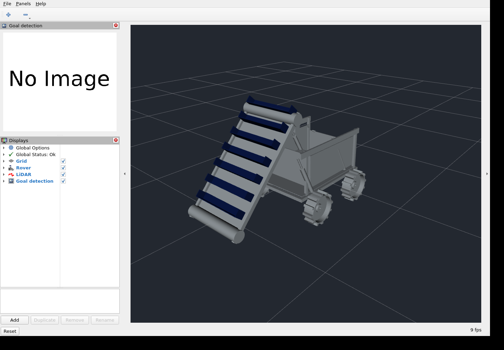
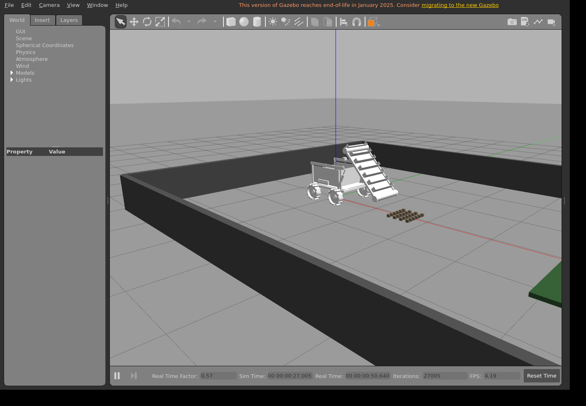

# Target-environment validation

Verified simulation source: `a8d5f6cc39775b93eef177a1c34e09acdc090bc5`.

[Successful Gazebo/RViz and KiCad run](https://github.com/Matthew-Garcia/NASA-Lunabotics-UHCL-Lunar-Hawks/actions/runs/34300162141).

## Results

- ROS 2 Humble / Gazebo 11: colcon compilation succeeds, Gazebo spawns the rover and RViz starts with software OpenGL under Xvfb.
- Fifteen runtime checks pass: camera/LiDAR/odometry/joint/mechanism messages; initial stow and latch; blocked conveyor while stowed; deploy; moving scoops; conveyor stop; retract; latch blocks tip; release; tip; passive door opening; lower; passive door closure; re-latch; drive displacement.
- The door reached about 0.925 rad while the bucket tipped, then returned below the unchanged 0.04 rad closure threshold through gravity. Bucket SetPosition now preserves descendant world velocities, allowing the passive door to swing. No door motor or forced closure is used.
- KiCad 9.0.9: schematic loads, SVG export succeeds, ERC reports **0 errors and 0 warnings**. Local symbol library and table resolve module symbols. Connector placement uses the electrical grid; dangling USB labels were terminated at sensor ports.
- 24 host tests pass, including seven mission tests with ROS message stubs.

Raw reports: [Gazebo runtime](gazebo-runtime.json), [KiCad ERC](kicad-erc.rpt). Workflow artifacts include runtime logs, screenshots, schematic SVG and compiler logs. Re-run `.github/workflows/validate-rover.yml` to regenerate evidence.

## What these checks do not establish

The probe directly commands mechanisms; it does not run the complete autonomous mission or establish goal detection accuracy, navigation, rock retention, or delivery into the pad. Material pickup and transfer remain scripted. Bucket/lift actuation is kinematic, actuator geometry is illustrative, and wheels use simplified collision cylinders. ROS TF completeness and sensor calibration need further validation.

The schematic is a module-level wiring draft using generic passive connector pins. Clean ERC cannot verify real module pinouts, voltage compatibility, BLDC controller selection, contactor/fuse sizing, grounding, actuator synchronization or production readiness. Original assembly dimensions and enclosure fits remain unverified. No physical hardware was operated.

## Captured views

Both applications were raised separately and inspected. RViz renders the rover; its goal-detection image is blank because the probe leaves the optional autonomy/perception launch disabled.

