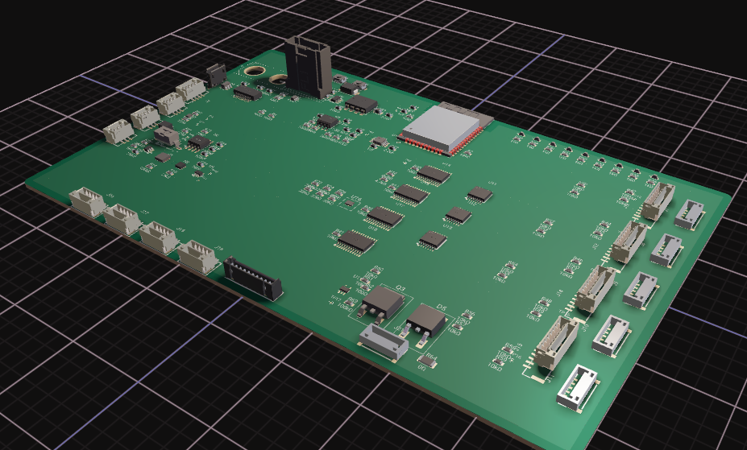
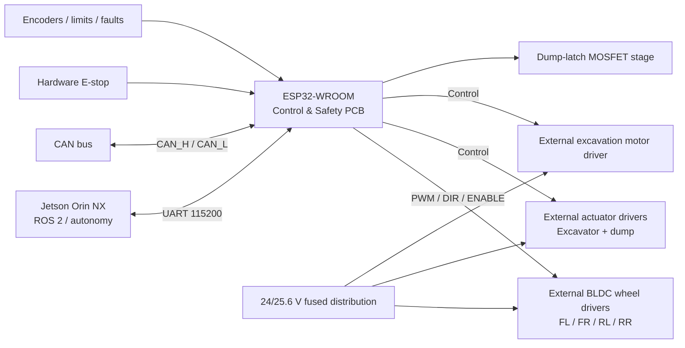

# Lunar Hawks Rover Control & Safety PCB — Rev A

**Status: active Rev A development.** Preliminary schematic and component placement are complete. Bulk routing, final electrical validation, fabrication, and hardware testing are still pending. No manufacturing release or Gerber package is provided yet.

  

## Purpose

This board is the low-level control, safety, communications, and sensor-interface layer for the UHCL Lunar Hawks proof-of-concept excavation rover. The NVIDIA Jetson Orin NX remains the high-level ROS 2 / autonomy computer; the **ESP32-WROOM** on this PCB handles deterministic low-level I/O and interfaces to external motor and actuator drivers.

**High-current wheel, excavation, and linear-actuator load current remains off this PCB.** External driver boards receive fused battery power separately and connect to this PCB only through low-current command, enable, fault/status, and reference signals.

## Rev A architecture

- ESP32-WROOM low-level controller
- Jetson UART at 115200 baud
- Classical CAN / ESP32 TWAI through an external CAN transceiver
- Protected nominal 24 V / 25.6 V LiFePO4 control-power input with 5 V and 3.3 V rails
- Independent hardware E-stop / global `MOTION_ENABLE` safety path
- Four wheel-driver interfaces: FL, FR, RL, RR
- Four linear-actuator driver interfaces: `ACT_EXC_1`, `ACT_EXC_2`, `ACT_DUMP_1`, `ACT_DUMP_2`
- Separate excavation/conveyor motor-driver interface
- Dedicated energize-to-release dump-latch output stage
- Wheel encoder, limit-switch, driver-fault, and diagnostic/test-point provisions
- USB/programming and debug provisions for the ESP32-WROOM

## Current PCB state

Flux placement is provisionally complete for a **160 × 100 mm** working outline using a four-layer stack:

- L1 — signals and components
- L2 — continuous ground plane
- L3 — power distribution
- L4 — signals and components

All 182 placed components passed the checked placement, edge, bounds, and ESP32 RF-keepout criteria. D3 and U4 footprint copper errors were corrected and independently checked. Power-plane work has started, but it still requires reconciliation before routing resumes. A CAN_H routability/width warning also remains to be resolved without a waiver.

The current layout separates the protected 24 V, 5 V, and 3.3 V power regions while preserving the ESP32 antenna keepout and the approved connector zoning. Signal routing has not yet been completed.

## Design files

- [`schematic/`](schematic/) — Rev A architecture sheets plus the compressed Flux EDIF export
- [`pcb/`](pcb/) — layout notes plus the compressed Flux D356 layout/netlist export
- [`bom/`](bom/) — preliminary BOM information; selections/MPNs are not yet a released purchasing BOM
- [`images/`](images/) — PCB render and placement/power-plane review images
- [`cad/`](cad/) — mechanical-CAD export notes and checksum for the current STEP model
- [`source/`](source/) — native Flux source archive notes and checksum
- [`specifications/`](specifications/) — requirements, interfaces, and design-review gates

## Important release note

This is a **development design**, not a fabrication-tested controller. External driver electrical specifications, final load/current budget, connector mechanics, mounting geometry, CAN routing, power widths, final DRC, and hardware bring-up must be completed before ordering boards or connecting rover loads.
