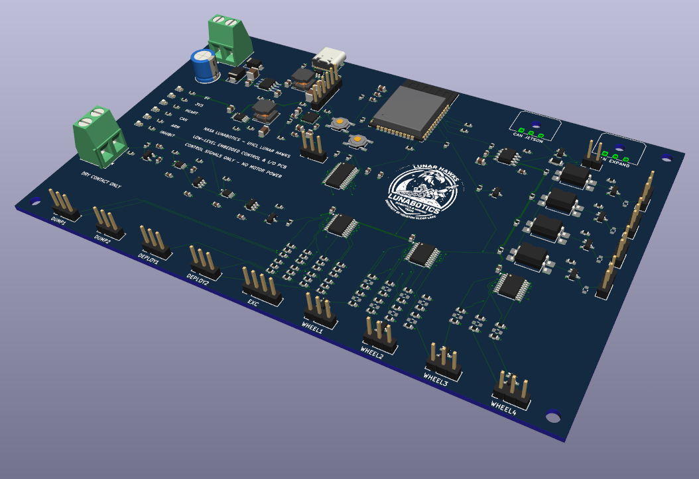
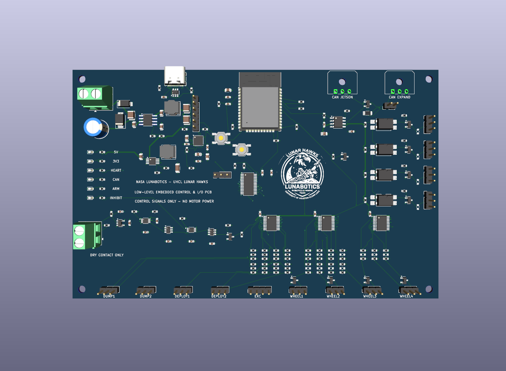
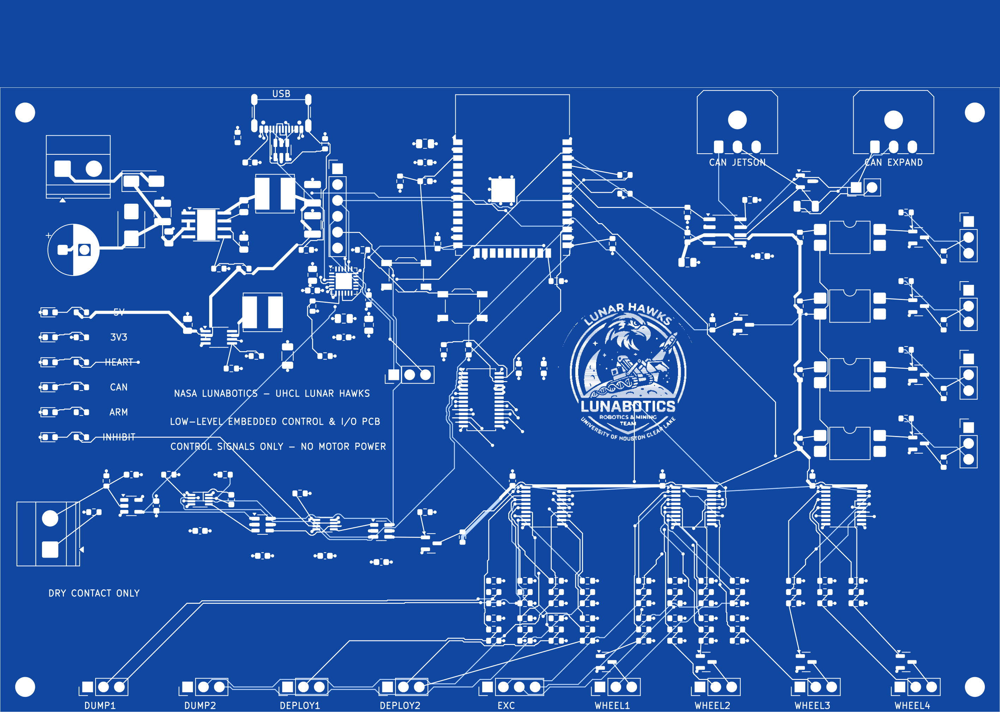
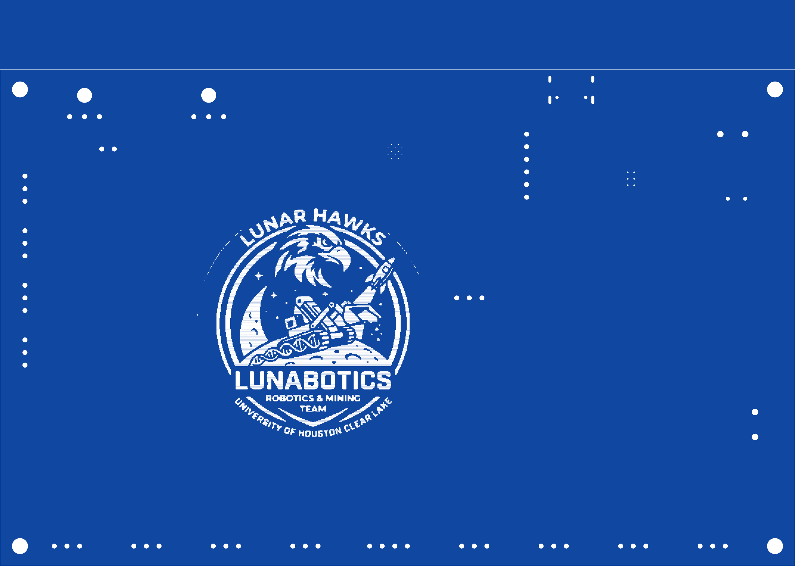

# NASA Lunabotics — UHCL Lunar Hawks Low-Level Embedded Control & I/O PCB

**Native KiCad 9.0 rover-control hardware design** for the University of Houston–Clear Lake Lunar Hawks Lunabotics rover.

This board is the rover's **low-level embedded control and I/O PCB**. The NVIDIA Jetson Orin NX remains the high-level ROS 2/autonomy computer, while this PCB handles the hardware-facing embedded layer: ESP32 control, CAN communication, programming/service I/O, safety/inhibit logic, and command interfaces to external wheel and mechanism drivers.

> **Engineering draft — not released for fabrication or powered operation.** ERC/DRC results establish design-file consistency, not electrical, thermal, RF, EMC, harness, or safety qualification.

## Designed in KiCad 9.0

The controller is designed and maintained **natively in KiCad 9.0**. The current design snapshot was validated with the KiCad 9 toolchain.

The KiCad project includes the project file, hierarchical schematic sheets, routed PCB layout, local symbol resources, 3D-model support, board artwork, BOM/component records, placement data, layout notes, and electrical validation reports.

## Rover control hierarchy

```text
NVIDIA Jetson Orin NX
High-level ROS 2 / autonomy / perception / planning
                 |
                 | CAN / system interface
                 v
LOW-LEVEL EMBEDDED CONTROL & I/O PCB
ESP32 / safety logic / command generation / hardware I/O
                 |
                 v
External motor drivers / actuators / excavation / disposal
```

The board silkscreen identifies the design as:

- **NASA LUNABOTICS — UHCL LUNAR HAWKS**
- **LOW-LEVEL EMBEDDED CONTROL & I/O PCB**
- **CONTROL SIGNALS ONLY — NO MOTOR POWER**

## Current board

- 160 × 100 mm working outline
- four copper layers
- blue solder mask / white silkscreen configuration
- ESP32-WROOM-32E-N4 embedded controller module
- USB-C programming/service interface
- Classical CAN interface with two parallel connectors and selectable 120 Ω termination
- four external BLDC wheel-driver command interfaces
- external linear-actuator / excavation / deployment / disposal command interfaces
- protected controller power conversion to 5 V and 3.3 V rails
- watchdog, re-arm, command-enable, and inhibit logic
- provisional wheel-stop request interfaces
- system/status indicators and service headers
- four mounting holes and Lunar Hawks board artwork
- **motor-current paths remain external to the PCB**

## Architecture notes

**Embedded controller:** the ESP32 provides the low-level hardware-control layer. Manual BOOT/reset support and the USB programming path are integrated on the board.

**CAN:** the controller-side CAN node includes the transceiver, protection, parallel bus connectors, and selectable termination. The Jetson requires its own appropriate CAN transceiver/adapter; logic-level CAN signals are not connected directly to CAN_H/CAN_L.

**Driver interfaces:** motor power is intentionally external. This PCB supplies command/control interfaces to the external wheel and rover-mechanism driver hardware.

**Safety/inhibit layer:** low-voltage interlock, watchdog, arm/re-arm, and command-inhibit functions are included. This PCB is not a safety-rated high-current disconnect; the rover's high-current emergency power interruption remains external.

## Board previews

### 3D board render

<p align="center">
  
</p>

### Top view

<p align="center">
  
</p>

### Front PCB layout

<p align="center">
  
</p>

## Open the project

Open `Lunar_Hawks_Rover_Control.kicad_pro` in KiCad 9 with the standard KiCad symbol, footprint, and 3D-model libraries installed. Keep all child schematics, `Rover.kicad_sym`, `sym-lib-table`, and the `3dmodels` folder together. The corrected ESP32-WROOM-32E model is bundled and referenced using `${KIPRJMOD}`; other component models use standard KiCad libraries. The artwork is embedded in the PCB and the source image is preserved in `artwork/`.

## Current design

- 160 × 100 mm, four copper layers, blue solder mask and white silkscreen.
- Soldered ESP32-WROOM-32E-N4 module with integrated antenna; USB-C programming and Classical CAN interface.
- Interfaces for four external BLDC drivers, four external linear-actuator drivers, and one external excavator driver.
- Controller power conversion, status LEDs, watchdog/re-arm logic, and provisional wheel-stop interfaces.
- 201 schematic components: 186 populated and 15 DNP. Four mounting-hole footprints and two board-only logo footprints are additional, for 207 footprints total.
- 23 mm front logo and 48 mm rear logo. Their fine details require fabricator silkscreen capability review.
- Motor-current paths remain external to this controller PCB.

The preview uses white/light-blue trace colors for readability; these are display colors. The native PCB defines the manufacturing layers.

## Validation snapshot — September 16, 2026

KiCad 9.0.4 was run on this board with both logos, all-track-error reporting, schematic parity, and all severities including exclusions:

| Check | Result |
| --- | ---: |
| PCB DRC violations | 0 |
| Unconnected PCB items | 0 |
| Schematic/PCB parity issues | 0 |
| Schematic ERC errors | 0 |
| Schematic ERC warnings | 0 |

Reports: [PCB DRC](validation/PCB_Both_Logos_DRC.json), [schematic ERC](validation/Schematic_Both_Logos_ERC.rpt), and [layout status](validation/PCB_Layout_Status.json).

## BOM and design documentation

- [Grouped draft BOM](bom/BOM.md) and [individual component records](bom/BOM_Components.json). Exact ordering codes still marked TBD must be selected and verified before purchase.
- [Physical layout notes](docs/PCB_Layout_Notes.md), [power design](docs/Power_Design.md), [driver interfaces](docs/Driver_Interfaces.md), [interlock design](docs/Safety_And_Driver_Design.md), and [wheel-stop interfaces](docs/Wheel_Stop_Design.md).
- [Hardware requirements](docs/Hardware_Requirements.md) and [detailed design notes](docs/Design_Notes.md).
- `data/PCB_Placement.csv` is a draft position inventory of the 201 circuit components and four mounting holes; artwork is excluded. It is not a released assembly pick-and-place file.

## Remaining engineering review

Review power-converter current paths and thermal behavior, USB routing, ESP32 footprint and antenna clearance, exact component packages, connector pinouts/control levels, mounting dimensions, and the manufacturing stackup. Resolve the external E-stop DC interruption rating and J301 dry-contact permissive wiring; qualify DNP driver links. Sensor/end-limit circuits, paired-actuator synchronization, firmware, and hardware testing remain outstanding. The sensor sheet is a placeholder. No manufacturing Gerber/drill release is included.

## Rear PCB artwork

<p align="center">
  
</p>